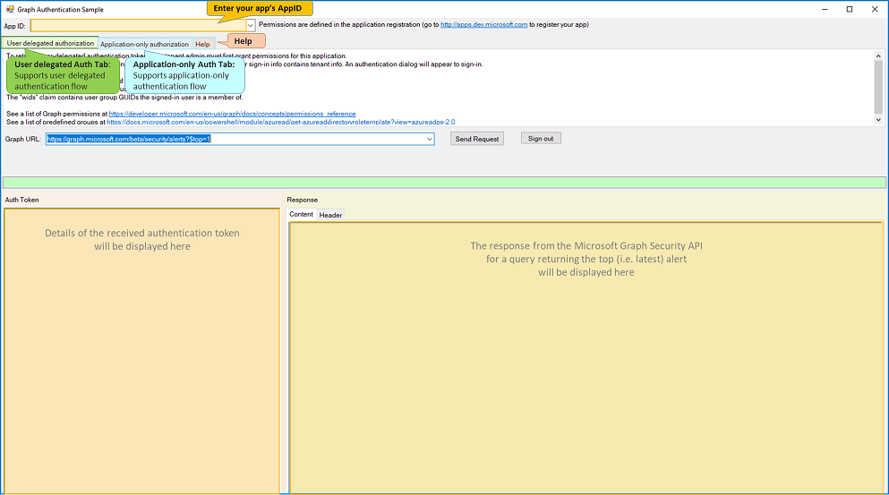
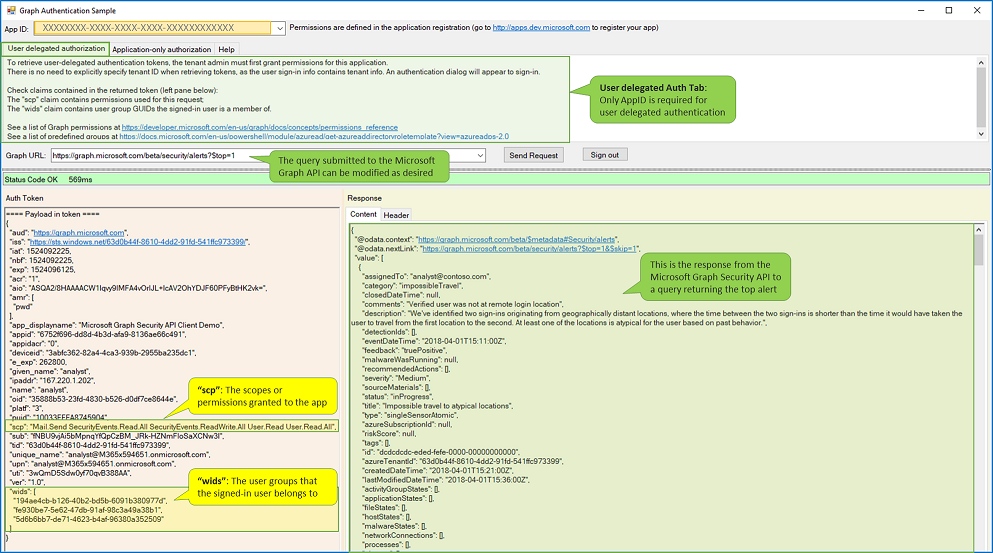
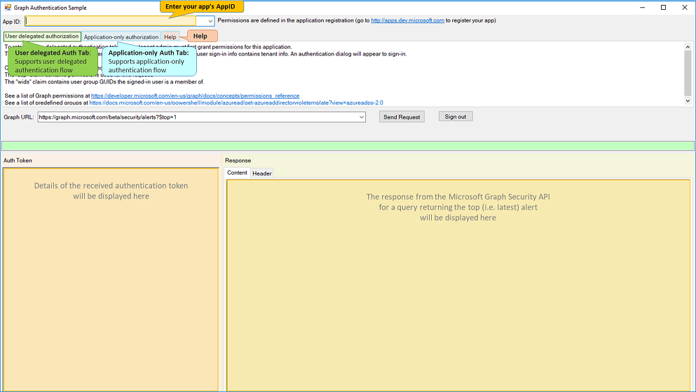

# C# Microsoft Graph Authentication sample application

## Introduction

Security data accessible via the Microsoft Graph Security API is very sensitive and therefore protected by permissions (aka scopes) and Azure AD (AAD) roles. 
The Microsoft Graph Security API enforces authentication and authorization (AuthNZ) to protect the sensitive data it makes accessible. This is documented in more detail in [Understanding authorization when calling the Microsoft Graph Security API](https://techcommunity.microsoft.com/t5/Using-Microsoft-Graph-Security/Authorization-and-Microsoft-Graph-Security-API/m-p/184376#M2) on the Microsoft Graph Security API Tech Community 

## Authentication and authorization in Microsoft Graph

Microsoft Graph Security API supports two types of application authentication and authorization (aka AuthNZ):
* **Application-only authorization**, where there is no signed-in user (e.g. a standard SIEM, or automation scenario).
Here the permissions/scopes granted to the application determine authorization
* **User delegated authorization**, where a user who is a member of the AAD tenant is signed in.

To call the Microsoft Graph Security API, the user must belong to the AAD Security Reader Limited Admin role, the required permissions (aka scopes) must be defined in the [**application registration**](http://apps.dev.microsoft.com), and the application must be granted the required permissions by the Azure AD tenant Administrator. This process is also described in the [Microsoft Graph Security API Sample for ASP.NET 4.6 (REST)](https://github.com/microsoftgraph/aspnet-security-api-sample)

This sample Graph Authentication application provides more visibility into both types of AuthNZ when calling the Microsoft Graph Security API, by displaying the contents of the auth token as well as the response contents and headers.
The application has one tab for User delegated authentication and another for Application-only authentication. 
It also has a **Help** tab with some common errors and fixes.
The app also allows you to enter the REST query of your choice to be able to see the response. 

## Required information to run the application

Information you'll need to run the Graph Authentication app:
![For both types of authentication]:
* **App ID** - from application registration (all you need for User delegated authentication)
![For Application-only authentication] (in addition to the App ID)
* **App Key** (aka App Secret) - also from application registration
* **Tenant ID** (ID of your Azure AD tenant) - this is a mandatory property of any Microsoft Graph Security API entity (response)

## Getting started with the Graph Authentication Sample app

 1. Download or clone the Microsoft Graph Authentication Sample.

 2. If you haven't registered an application, defined required permissions and explicitly granted these permissions, follow the instructions in the [Microsoft Graph Security API Sample for ASP.NET 4.6 (REST)](https://github.com/microsoftgraph/aspnet-security-api-sample) to do so. (Be sure to save the App Key (aka App Secret) when you register the sample application).

 3. Be sure to add **native application** on the application registration page if you're running the ASP.NET sample. This is required for the Microsoft Graph Security Authentication Sample App.
 
 ## Configure and run the sample app
 1. Open the Graph_Security_API_Auth_Sample project.
 
 2. Press F5 to build and run the sample. This will restore NuGet package dependencies and open the application.

   >If you see any errors while installing packages, make sure the local path where you placed the solution is not too long/deep. Moving the solution closer to the root of your drive will resolve this issue.

## Using the Microsoft Graph Authentication Sample app

1. Launching the sample app will display the sample app's UI

2. Enter the App ID in the text box at the top of the page

## Testing User delegated authorization

1. To run the User delegated authentication flow, click the **Send request** button. The Microsoft authentication dialog will open.

2. Sign in with your work or school account.

3. The Sample app UI will display the Auth token in the left pane as we see below 

* The **scp** property (highlighted) shows the scopes or permissions granted to the user
* The **wids** property shows the GUIDs of the user groups the signed-in user belongs to

4. The response to the REST query that appears in the Graph URL text box (its default value returns the top, i.e. latest, alert). This is the complete JSON response received from the Microsoft Graph Security API. Clicking on the **Header** tab of the response displays the HTTP headers of the response.

* Note: You can change the REST query submitted to the Microsoft Graph Security API by editing the URL in the **Graph URL** text box

## Testing Application-only authorization (no signed-in user)

1. To run the Application-only authentication flow, you need to:

* Enter the App Key (or App Secret) that was generated wihen you registered your app.
* Enter the AAD tenant ID (you can grab this from the "azureTenantId" property in the response in the User delegated auth flow above)
* Click the **Send request** button. 

2. The Sample app UI will display the Application-only Auth token in the left pane as we see below 

* Here the **roles** property (highlighted) shows the scopes or permissions granted to the application
* The JSON response to the REST query is the same as in the previous example

## The Help tab

The **Help** tab contains some common errors, the reason they occur, and ways to resolve (fix) them 

## Resources

Documentation:
* [Understanding authorization when calling the Microsoft Graph Security API](https://techcommunity.microsoft.com/t5/Using-Microsoft-Graph-Security/Authorization-and-Microsoft-Graph-Security-API/m-p/184376#M2)
* [Microsoft Graph permissions reference](https://developer.microsoft.com/en-us/graph/docs/concepts/permissions_reference)

Other Samples:
* [Microsoft Graph Security API Sample for ASP.NET 4.6 (REST)](https://github.com/microsoftgraph/aspnet-security-api-sample)
